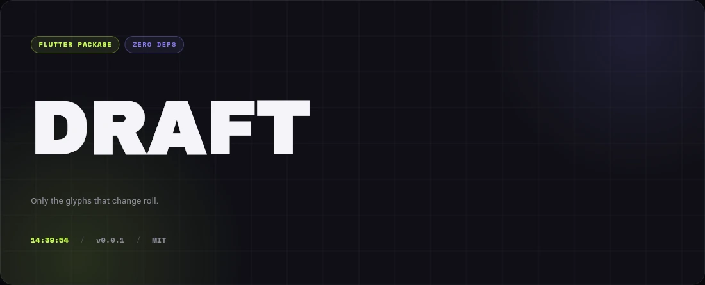

# reel_text

Dependency-light Flutter text roll animation for short labels, counters, status
text, and command buttons.

`reel_text` brings the DOM text-roll idea from
[Danilaa1's original package](https://github.com/Danilaa1/slot-text) to
Flutter: every glyph gets its own measured slot, changed glyphs slide
vertically, optional color flashes fade back to the inherited text color, and
imperative `flash()` calls are safe for rapid button taps.



[Live demo](https://kicknext.github.io/reel_text/)

## Install

```yaml
dependencies:
  reel_text: ^0.0.1
```

## Quick Start

```dart
import 'package:reel_text/reel_text.dart';

const ReelText('Copy');
```

For the classic `Copy -> Copied -> Copy` interaction:

```dart
final controller = ReelTextController(initialText: 'Copy');

ReelText.controller(controller: controller);

controller.flash(
  'Copied',
  options: ReelTextFlashOptions(
    enter: ReelTextOptions(colorBuilder: chromatic()),
  ),
);
```

## API

### Declarative

```dart
ReelText(
  copied ? 'Copied' : 'Copy',
  options: ReelTextOptions(
    direction: copied ? ReelTextDirection.up : ReelTextDirection.down,
    colorBuilder: copied ? chromatic() : null,
  ),
);
```

### Imperative

```dart
final label = ReelTextController(initialText: 'Copy');

label.set('Copied');
label.set(
  'Copy',
  options: const ReelTextOptions(direction: ReelTextDirection.down),
);
label.flash('Copied');
label.dispose();
```

`flash()` captures the resting text on the first flash in a burst, resets the
revert timer on repeated calls, and rolls back once after the last flash.
Calling `set()` cancels a pending revert.

For async operations, use `startProgress()` and resolve the returned handle:

```dart
final exportLabel = ReelTextController(initialText: 'Export');

final progress = exportLabel.startProgress(
  'Exportaa',
  frames: const ['Exportee', 'Exportii', 'Exportoo'],
  interval: const Duration(milliseconds: 160),
  options: ReelTextOptions(colorBuilder: chromatic(from: 36, spread: 54)),
);

try {
  await exportFile();
  progress.complete(
    'Exported',
    options: const ReelTextOptions(color: Color(0xff38bdf8)),
  );
} catch (_) {
  progress.fail(
    'Error',
    options: const ReelTextOptions(color: Color(0xffe11d48)),
  );
}
```

The progress loop keeps rolling until the handle is completed, failed, or
cancelled. Matching glyphs stay fixed by default, so `Export -> Exportaa ->
Exportee -> Exportii` continuously animates the two uncertain suffix slots while
waiting. `complete('Exported')` then performs the normal diff into the final
word. Each emitted target accepts its own `ReelTextOptions`, so intermediate
progress, success, and error states can use different color modes.

### Waiting (idle) animations

For the common case you don't need to invent frames: `startWaiting()` loops a
designed idle animation until its handle is resolved.

```dart
final label = ReelTextController(initialText: 'Export');

final handle = label.startWaiting('Exporting');
try {
  await exportFile();
  handle.complete('Exported');
} catch (_) {
  handle.fail('Failed');
}
```

Pick the look with a `ReelWaiting` preset:

```dart
// Trailing dots: Exporting -> Exporting. -> Exporting.. -> Exporting...
label.startWaiting('Exporting', waiting: const ReelWaiting.ellipsis());

// The label stays readable and periodically "breathes": one stagger wave of
// self-rolls sweeps across the glyphs, then the word rests.
label.startWaiting(
  'Exporting',
  waiting: const ReelWaiting.wave(rest: Duration(milliseconds: 1200)),
);

// Explicit frames or a generator for full control (scrambles, spinners, ...).
label.startWaiting(
  'Exporting',
  waiting: ReelWaiting.builder((text, tick) => tick.isEven ? text : '$text…'),
);
```

All presets compile down to the same roll engine. Each preset ships with
designed motion defaults — `ellipsis` ticks on a steady, metronome-like beat
derived from the roll duration, and `wave` uses a calm, non-springy curve with
almost no tilt so the loop reads as a ripple instead of a glitch. Pass your own
`ReelTextOptions` to take full control of direction, curve, stagger, and color.

### Reduced motion

When the platform requests reduced motion
(`MediaQuery.disableAnimationsOf(context)`), `ReelText` snaps to the target
text instantly instead of rolling. Opt out per widget with
`respectDisableAnimations: false`.

### Dynamic fonts

`ReelText` measures glyph slots from the active Flutter text layout. If your app
loads fonts asynchronously, preload them before the first `ReelText` frame so
initial slot widths are measured with the final font:

```dart
Future<void> main() async {
  WidgetsFlutterBinding.ensureInitialized();
  GoogleFonts.archivoBlack();
  await GoogleFonts.pendingFonts();
  runApp(const App());
}
```

## Options

| Option | Default | Description |
| --- | --- | --- |
| `direction` | `ReelTextDirection.down` | Roll direction. |
| `stagger` | `45ms` | Delay between glyph starts. |
| `duration` | `300ms` | Per-glyph slide duration. |
| `exitOffset` | `50ms` | Delay before incoming glyphs chase outgoing glyphs. |
| `curve` | springy cubic | Slide curve. |
| `bounce` | `0.6` | Per-glyph timing/tilt variation and settle-overshoot depth. |
| `color` | null | Flat incoming glyph tint. |
| `colorBuilder` | null | Per-glyph incoming tint, such as `chromatic()`. |
| `colorFade` | `280ms` | Tint fade-back duration. |
| `skipUnchanged` | `true` | Keeps identical same-index glyphs static. |
| `interrupt` | `true` | Interrupt in-flight rolls or queue the latest target. |

## Example

Run the included example:

```bash
cd example
flutter run
```

The example is a two-page studio: **Showcase** is a designed demo of the hero
roll, the three waiting presets, async operation handles, counters, and a
motion desk; **Recipes** pairs live, working previews with copy-ready code for
the most common situations (declarative swaps, `flash()` buttons, async
handles, waiting presets, tabular counters, spam-safe buttons, and reduced
motion).
